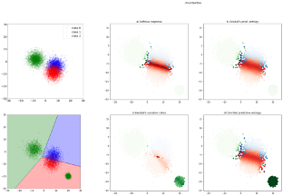
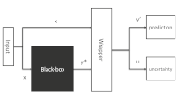

# Uncertainty assessment for Pre-trained models

Jose Mena


## Motivation

Imagine one of the following situations:

- You have trained a model for medical diagnosis to enable the early detection of an illness based on images obtained from an X-ray machine of a hospital. You train a model using labelled data to predict whether the patient has the illness or not based on her corresponding image. Now, a new hospital is interested on your model and they ask you to start using it, but then you realize that they use a different X-ray machine. To which extent is your model good at predicting using the new images? How can you trust these predictions?
- You find an API that offers a Sentiment Analysis classifier. At the documentation you can read that the model was trained using reviews of Amazon products. The point is that you want to apply it to reviews of restaurants that you plan to use as implicit feedback for a tourism recommender system. How will the API work in the new domain? A horror movie can be terrifying and thus have a good review, but I don&#39;t see how a terrifying restaurant could be good.

Of course, there might be situations where getting some labelled data for the target domain can enable to fine-tune the original model or even training it from scratch, but sometimes this is not an option, as we don&#39;t have access to the original model or to the resources needed for training it.

What if we could have a way to tell if the prediction for the new dataset is confident or not? Picture a system that, together with the prediction of the model, you could have a metric of its uncertainty. Usually, a useful way of measuring this uncertainty, in probabilistic classifiers, is by observing the output probabilities. A probability of 0.9 for the predicted class would mean a very confident prediction. The problem with this approach is that there is no guarantee that these probabilities are well-calibrated (that they are real probabilities), and, besides, there might be cases where the prediction might be very confident, like this 0.9, but that it corresponds to a wrong prediction.

Take for example, a linear classifier trained with the date at the top-left figure. When we apply to the target data, bottom-left figure, we observe that there is a mass of points that will be wrongly classified, as they are in the class 1 region, but they are labelled as class 2.



Imagine that this classifier was trained to predict if an image belongs to a cat, a dog or a bear. Imagine that the images used for training that classifier included white cats, but only black or brown bears. At prediction time, we get pictures of polar bears. Our classifier we&#39;ll try to do its best and it may predict them as cats, as it only had seen white animals belonging to the cat category.

 

## Uncertainty wrapper

The component here presented tackles the scenario of having a pre-trained classifier, from now on a black-box, and trying to apply it to a new target scenario.

What we propose in this component is a wrapper that takes the input and the output of the black-box and enriches the later with a measure of uncertainty. Based on this uncertainty, you are be free of &quot;trusting&quot; the prediction or discard it. If the overall results of applying the black box to your problem are poor, maybe you would have to reconsider the option of labelling more data and train a specific classifier for the target problem.

Further theoretical details can be found at the paper [https://ieeexplore.ieee.org/document/9097854](https://ieeexplore.ieee.org/document/9097854), but the main idea is that we have a black-box classification system that takes as input a feature vector **x** , or an embedding, in the case of images and texts, and outputs a probability distribution **y\*** over the predicted categories or classes. The wrapper produces a new prediction **y&#39;** together with an uncertainty score for this prediction **u** , as illustrated in the following diagram:



In the instantiation of the wrapper, these are the parameters that can be set:

| Name | Type | Mandatory |
| --- | --- | --- |
| **black\_box** | An object that observes the sklearn BaseEstimator interface. This will be used as the black box to retrieve the original predictions | Optional, if not set, then a list of predictions on X must be passed on fit and predict |
| **lambda_reg** | Regularization property used for adjusting the uncertainties | no, default 1e-2
| **num_samples** | Number of samples to include for the MC sampling of the dirichlet dsitribution | no, default 1000 |
| **learning_rate** | Learning rate used when training uncertainties | no, default 1e-3 |
| **num_hidden_units** | Number of units to use in the uncertainty neural network model | no, default 20 |
| **batch_size** | Batch size used when training uncertainties | no, default 256 |
| **epochs** | Number of epochs when training the uncertainties | no, default 50 |
| **verbose** | Verbosity level ofthe training(same as in Keras) | no, default 0 |

Usually these parameters produces good estimates for the uncertainty but, depending on the case, they have to be tuned to avoid overfitting.

The wrapper offers two methods (following the sklearn standard):

### fit

This method is meant for training the wrapper. It needs some examples of the target domain **(x, y)** and will call the black-box for the corresponding **y\***.

| Name | Type | Mandatory |
| --- | --- | --- |
| **X** | Vector of input vectors | yes |
| **y** | Vector of labels | yes |
| **pred_y** | Vector of blackbox predictions on X | yes, when there is no blackbox defined |

#### Returns

A wrapper model trained for the target dataset

### Predict

This method applies the wrapper to obtain the prediction and the associated uncertainty. It takes the input **x** and calls the black-box for a list of the corresponding **y\***.

| Name | Type | Mandatory |
| --- | --- | --- |
| **X** | Vector of input vectors | yes |
| **pred_y** | Vector of blackbox predictions on X | yes, when there is no blackbox defined |

#### Returns

A list of pairs (y\*, u) corresponding to the prediction and the degree of uncertainty.

_IMPORTANT: Note that the output of the black box, the original prediction can be in the form of a probability distribution over the categories of the classifier, as resulting from the usual softmax layer, or a categorical output, consisting on the identifier of the predicted class. In both cases, the wrapper will be able to add the corresponding uncertainty._

## Example

In the examples folder you will find an example(script or notebook) of a potential use case for the library.
The example shows how to apply the uncertainty wrapper to enrich the predictions of a trained classifier with 
the corresponding uncertainty when applied to a new domain of application. The goal is to show how to use
a classifier already trained for one task in another task, and how we can measure that the blackbox adapts for the 
new task. We will see how wecan identify the cases where the blackbox is less confident on its predictions, 
and how we can increase the accuracy of the resulting system by rejecting those examples that more uncertain.

# Setup

## Requirements

* Python 3.6+
* scipy
* pandas
* numpy
* scikit-learn
* tensorflow==1.15.2
* tensorflow_probability==0.7.0

## Installation

Install it directly into an activated virtual environment:

```text
$ pip3 install uncwrap
```

# Usage

After installation, the package can be imported:

```text
$ python
>>> import uncwrap
>>> uncwrap.__version__
```
